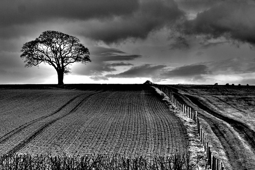
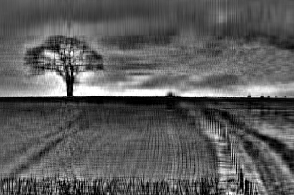

# Image compressor usuing singular value decomposition (SVD)

## Description
This Python 3 program can compress a png image to a smaller black and white image using SVD.

The image is into a matrix with each element having the black intensity value of a pixel. If the image isn't black and white,
the pixel values are adjusted accordingly to represesnt a black and white image. The values of the matrix are 
operated on using self implemented Matrix and Vector classes. The program uses image.py to convert the png file to pixel values. 

The image generated is a rank-k approximation of the original image based on a user-entered k value. 
The higher the k-value, the more detailed the image, the higher the cumulative energy, and the more space it takes up. 

Below are some sample images:

### Original Image

### Rank-20 Approximation

### Original Image

### Approximation retaining 95% cumulative energy

### Approximation retaining 99% cumulative energy

## Future Directions
I plan on creating a WebApp using Flask framework with a user interface, where a user can upload an image
of their choice and compress it using this software.
